# Omar Autonomous Website

<h1 align="center">
  
</h1>

> **Make any vehicle autonomous in just 30 minutes.**  
> Affordable&nbsp;•&nbsp;Safe&nbsp;•&nbsp;Human‑centred autonomy.

---

## Table of Contents
1. [Overview](#overview)  
2. [Features](#features)  
3. [Tech Stack](#tech-stack)  
4. [Project Structure](#project-structure)  
5. [Getting Started](#getting-started)  
6. [Development Pipeline](#development-pipeline)  
7. [System Architecture](#system-architecture)  
8. [Available Scripts](#available-scripts)  
9. [Contributing](#contributing)  
10. [License](#license)

---

## Overview
Omar Autonomous is a modern **Next.js&nbsp;14** application that showcases retro‑fit autonomous‑vehicle technology.  
The site is fully typed with **TypeScript**, styled with **Tailwind CSS**, and animated with **Framer Motion**, providing a fast, accessible, and responsive experience.


---

## Tech Stack
| Layer              | Technology |
| ------------------ | ---------- |
| Framework          | **Next.js 14** (app router, RSC) |
| Language           | **TypeScript 5** |
| Styling            | **Tailwind CSS ^3** |
| Component Library  | **shadcn/ui** |
| Animations         | **Framer Motion** |
| Icons              | **Lucide‑React** |
| Charts / Diagrams  | **Mermaid** (embedded) |
| Lint / Format      | **ESLint**, **Prettier** |
| CI / CD            | **GitHub Actions** → **Vercel** |

---

## Project Structure
```text
├── app/                # Route segments (RSC pages)
│   └── ...             # about, product, fleet-solutions, etc.
├── components/         # Reusable UI & section components
│   └── ui/             # shadcn-generated primitives
├── hooks/              # React client hooks
├── lib/                # Shared utilities
├── public/             # Static assets (images, logos)
├── styles/             # Global CSS (Tailwind base)
├── next.config.mjs     # Next.js configuration
├── tailwind.config.ts  # Tailwind design tokens
└── package.json
```

---

## Getting Started

### Prerequisites
- **Node.js ≥ 20**
- **pnpm ≥ 9** (or npm / yarn)

### Local Setup
```bash
# 1‒ Clone
git clone https://github.com/<your‑org>/omar-autonomous.git
cd omar-autonomous

# 2‒ Install deps
pnpm install       # or npm ci / yarn install

# 3‒ Run development server
pnpm dev           # http://localhost:3000
```

### Production Build
```bash
pnpm build         # Generates the `.next` output
pnpm start         # Serves the production build
```

---

## Development Pipeline

```mermaid
graph TD
  C(Commit) -->|Push| G[GitHub]
  G --> CI[GitHub Actions<br/>• Lint<br/>• Test<br/>• Build]
  CI --> V[Vercel Preview]
  V --> M(Merge → main)
  M --> P[Production Deploy 🌎]
```


---

## Available Scripts

| Command          | Purpose                           |
| ---------------- | --------------------------------- |
| `pnpm dev`       | Start dev server with hot reload  |
| `pnpm build`     | Production build (SSR + static)   |
| `pnpm start`     | Serve built app locally           |
| `pnpm lint`      | Lint code with ESLint             |
| `pnpm format`    | Format code with Prettier         |
| `pnpm typecheck` | Run TypeScript type‑checker       |

---

## Contributing
1. **Fork** the repo → create a **feature branch**.  
2. Commit with clear, conventional messages.  
3. Open a **Pull Request** targeting `main`.  
4. Pass CI checks → get reviewed → merged!

---

## License
Distributed under the **MIT License**.  
See [`LICENSE`](LICENSE) for details.

---

> _© Omar Autonomous 2025 – Saving lives, saving money._
